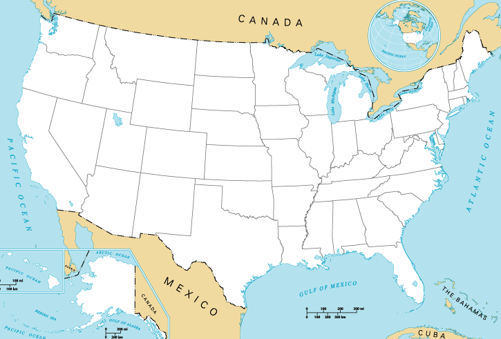

# 🗺️ U.S. States Quiz Game

A fun, interactive geography quiz built with Python! A blank map of the United States is displayed, and you have to name all 50 states from memory. Each correct guess gets labeled directly on the map.

## 🎮 Demo



## 🚀 Features

- Interactive blank U.S. map using Python Turtle
- Type state names and watch them appear on the map in real time
- Case-insensitive input (e.g. "texas" and "Texas" both work)
- Live score tracker in the input dialog title
- Duplicate guess prevention
- On exit, saves all missed states to `states_to_learn.csv` for review

## 🛠️ Tech Stack

- **Python 3.13**
- **Turtle** — graphics and map rendering
- **Pandas** — CSV reading and state coordinate lookup

## 📁 Project Structure

us-states-quiz-game/

├── main.py              

├── 50_states.csv        

├── blank_states_img.gif  

└── README.md


## ⚙️ Setup & Run

1. Clone the repository
```bash
git clone https://github.com/Aashrith1072/us-states-quiz-game.git
cd us-states-quiz-game
```

2. Install dependencies
```bash
uv add pandas
```

3. Run the game
```bash
python main.py
```

##  How to Play

1. A blank U.S. map appears on screen
2. A dialog box prompts you to enter a state name
3. Type a state and press Enter — it gets labeled on the map if correct
4. The dialog title shows your current score (e.g. `24/50 states correct`)
5. Close the dialog or press Cancel to quit early
6. Any states you missed will be saved to `states_to_learn.csv`

##  Sample CSV Format (`50_states.csv`)

| state | x | y |
|-------|-----|------|
| Alabama | 139 | -77 |
| Alaska | -204 | -170 |
| Arizona | -290 | -50 |
| California | -377 | -10 |
| New York | 265 | 65 |

##  What I Learned

- Working with Turtle graphics and event-driven programming
- Loading and querying DataFrames with Pandas
- Mapping coordinate data to visual positions on a image
- Building an interactive game loop with user input handling
- Handling edge cases like None input, duplicates, and case sensitivity

